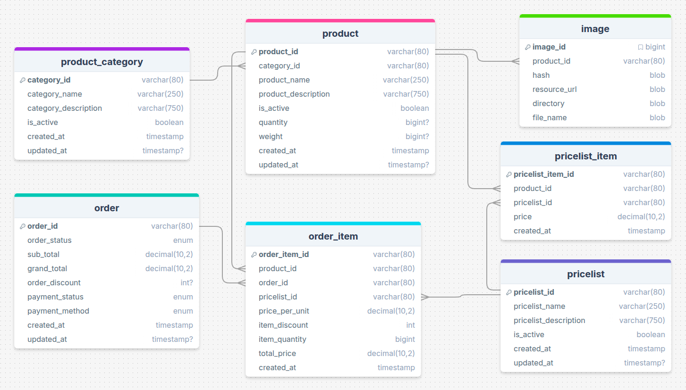

# Product Order Management System (Microservices)

A **Spring Boot microservices backend application** for managing products, categories, price lists, and customer orders.  
This project was developed as an **educational assignment** to demonstrate microservice architecture using Spring Cloud.

---

## Architecture

The system is built using a **microservices architecture** with the following components:

- **Service Registry** – Service discovery using Netflix Eureka
- **API Gateway** – Centralized request routing using Spring Cloud Gateway
- **CRUD Services** – Independent services handling business logic
- **Relational Database** – Data stored using relational tables

---

## Technologies Used

- Spring Boot
- Spring Cloud
- Netflix Eureka
- Spring Cloud Gateway
- Hibernate / JPA
- PostgreSQL
- Maven
- Java

---

## Database Structure

Main entities used in the system:

- **product_category** – Stores product categories  
- **product** – Stores product details  
- **image** – Stores product images  
- **pricelist** – Stores price lists  
- **pricelist_item** – Maps products to price lists  
- **order** – Stores customer orders  
- **order_item** – Stores items in each order

---

## Features

- Product & Category management
- Price list management
- Order management
- Product image handling
- Microservice communication via service discovery
- API routing through gateway

---

## Running the Project

1. Start the **Eureka Server**
2. Start the **API Gateway**
3. Start the **Microservices**
4. Connect the application to the configured database

---

## Purpose

This project was developed to practice:

- Microservice architecture
- Spring Boot backend development
- Service discovery and API gateway concepts
- Database design and CRUD operations
